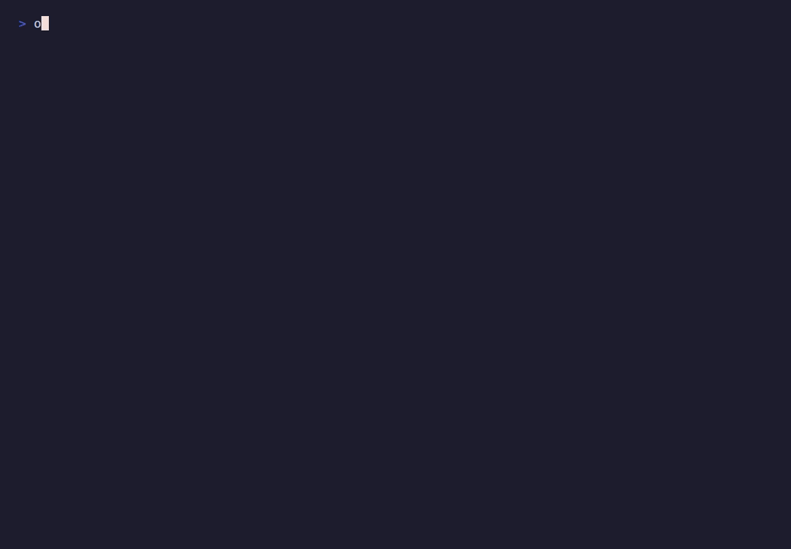
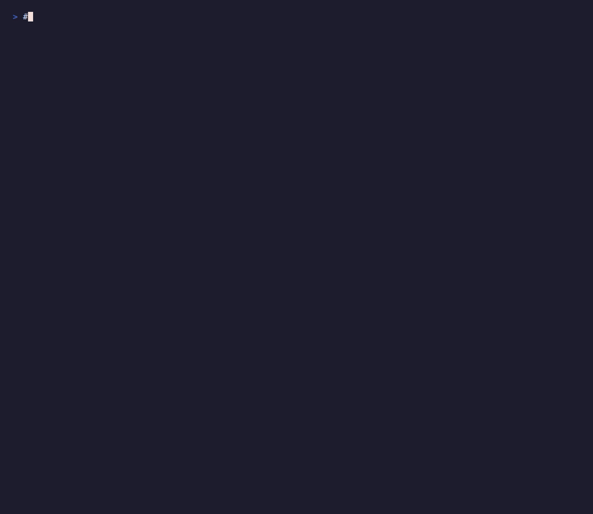

[](https://github.com/nao1215/omokage/actions/workflows/build.yml)
[](https://github.com/nao1215/omokage/actions/workflows/unit_test.yml)
[](https://github.com/nao1215/omokage/actions/workflows/reviewdog.yml)
[](https://github.com/nao1215/omokage/actions/workflows/coverage.yml)
[](https://pkg.go.dev/github.com/nao1215/omokage)
[](https://goreportcard.com/report/github.com/nao1215/omokage)


<p align="center">
  
</p>

omokage learns how you write from your past writing, then tells you how close a new draft is to that style. It runs locally and works on Japanese and English text.



## About the name

omokage (面影) is a Japanese word. It is written with 面 (face) and 影 (shadow, trace), and it means the remembered image of someone or something, the likeness that comes back to mind. I took the name from [Omokage](https://www.toraya-group.co.jp/products/collections/yokan-omokage), a yokan (red-bean jelly) made by Toraya that I like.

## Why I built it

I often draft text with an LLM and then rework it so that it reads like something I wrote. Prompting and hand-editing only get me so far, so I wanted a tool that measures how close a draft is to my own style and points out where it drifts. omokage is that tool. You train it on your past writing, then check a draft against it.

It is meant to be used by an LLM as much as by a person. An agent can run `check` after each rewrite, read the similarity and the differences, and keep revising until the draft sits closer to the trained voice.

## Install

```shell
go install github.com/nao1215/omokage@latest
```

It runs on Windows, macOS, and Linux. Building from source needs Go 1.25 or later.

## Usage

The repository includes a small example corpus under [examples/](./examples) so you can follow along.

Create a project in the current directory. This writes `omokage.toml`, `profiles/`, and `cache/`.

```shell
$ omokage init
Initialized omokage project.
Config: /home/me/blog/omokage.toml
Profiles: /home/me/blog/profiles
Cache: /home/me/blog/cache
```

Learn a style from past writing.

```shell
$ omokage train --author me examples/posts
Trained author "me" from 8 files.
Profile: /home/me/blog/profiles/me.db
```

Check whether a draft still reads like that author. With a single trained
profile you can drop `--author` entirely — omokage selects the only one.

```shell
$ omokage check examples/draft-keeps-voice.md
Author: me
Similarity: 73%

Differences:
- character n-gram "持ち" is higher than reference
- character n-gram "気持" is higher than reference
- character n-gram "気持ち" is higher than reference
```

The same idea rewritten in a stiff, formal voice scores low, and omokage shows what changed.

```shell
$ omokage check --author me examples/draft-lost-voice.md
Author: me
Similarity: 0%

Differences:
- polite sentence-ending ratio is lower than reference
- kanji ratio is higher than reference
- hiragana ratio is lower than reference
```

You can also compare two documents directly, without training a profile.

```shell
$ omokage diff examples/draft-keeps-voice.md examples/draft-lost-voice.md
Reference: examples/draft-keeps-voice.md
Target: examples/draft-lost-voice.md
Similarity: 54%

Differences:
- polite sentence-ending ratio is lower than reference
- paragraph length variance is lower than reference
- sentence length variance is higher than reference
```

Similarity runs from 0 to 100 and shows how close the text sits to the learned style. Differences lists the features that moved the most, such as the sentence-ending register (敬体 / 常体), the balance of kanji and kana, function-word and character n-gram usage, sentence length, and layout. omokage compares style rather than topic, so writing about something new in your usual voice still scores high.

For final tuning, add `--explain` to lead with the high-level, editable features (register, script balance, shape), each with the draft's value, your trained mean ± spread, a z-score, and a fix priority, plus the paragraphs that drift most. `--format json` prints the same data for an LLM to read between rewrites. Both are opt-in, so plain `check` stays fast.

```shell
$ omokage check --author me --explain examples/draft-lost-voice.md
Author: me
Similarity: 0%

High-level style differences (fix these first):
  1. polite sentence-ending ratio is lower than reference [register]
       target 0.000  reference 1.000 ± 0.000  (50.0σ)
  2. kanji ratio is higher than reference [script]
       target 0.489  reference 0.213 ± 0.025  (10.9σ)

Paragraphs that drift most:
  #4 (11.0σ; polite sentence-ending ratio lower): 特別な行為は一切実施していない。しかしながら…
```



## Choosing the author

`check` and `show` resolve the author in this order, so single-author use needs
no flags and multi-author use stays unambiguous:

1. `--author NAME`, if given;
2. otherwise `default_author` from the config;
3. otherwise the only trained profile;
4. otherwise it is an error — zero profiles, or two or more with no default,
   never silently picks one.

Set a default without editing the config by hand:

```shell
$ omokage train --author me --default examples/posts
```

## Managing profiles

You never have to touch `profiles/*.db` directly.

```shell
$ omokage list                 # bare names, one per line (pipe-friendly)
me
$ omokage list --long          # trained_at, file count, and source directory
AUTHOR        TRAINED            FILES  SOURCE
me (default)  2026-06-01 09:14   8      /home/me/writing/posts
$ omokage show --author me      # how a profile was trained (--format json too)
$ omokage rename --author me --to watashi
$ omokage remove --author watashi
```

`rename` keeps the trained data and refuses to overwrite an existing author;
`remove` clears `default_author` if it pointed at the removed profile.

## Local and global stores

By default omokage looks for an `omokage.toml` by walking up from the current
directory — a project-local store, good for keeping separate writing contexts
apart. For a single voice you can use anywhere, create a per-user store instead:

```shell
$ omokage init --global                       # under $OMOKAGE_HOME or ~/.config/omokage
$ omokage train --global --author me ~/writing
$ cd ~/anywhere && omokage check draft.md      # falls back to the global store
```

When both exist, a local project always wins inside its directory tree; the
global store is the fallback used only when no local project is found. `--global`
forces the global store from anywhere, and `--config PATH` / `--profile-dir PATH`
point omokage at a specific store.

## Scripting

`--score-only` prints just the integer similarity, for shell pipelines:

```shell
$ score=$(omokage check --score-only draft.md)
$ [ "$score" -ge 70 ] && echo "close enough"
```

Use `--format json` (with `check` or `show`) when a tool or LLM needs the full
structured report instead of a single number.

## How it scores

When you train an author, omokage reads every file, measures a set of stylistic features for each document, and stores their mean and spread in a SQLite database under `profiles/` (one database per author). The text itself is not kept, only the numbers.

The features fall into a few groups:

- Register: how often sentences end in the polite form (敬体) or the plain form (常体).
- Script balance: the ratio of kanji, hiragana, and katakana.
- Function words: the frequency of common particles and English function words (の, は, に, the, of, and, …).
- Character n-grams: the most frequent two- and three-character sequences.
- Shape: sentence length and its variation, punctuation and newline frequency, bullet and Markdown usage, paragraph length variation.

A check measures the same features on the draft and compares each one to how much it normally varies across your own writing, as a z-score in the spirit of Burrows's Delta. A feature that stays within your usual range costs nothing; one that strays far lowers the score. The function-word and n-gram fingerprint carries most of the signal, a clear register shift is penalized on top of that, and the shape features only nudge the result. Code blocks are removed before the features are measured, so the score reflects prose rather than code. `diff` uses the same features to compare two documents directly, without a stored profile.

## Limits

omokage looks at style, not meaning. It cannot tell whether a draft is correct, original, or well written, only whether it resembles the voice it was trained on. It needs a reasonable amount of training text: with a few short documents the measured spread is wide and the scores are noisy. It separates Japanese authors more sharply than English ones, and two people who write in the same register will look more alike than they really are. It is not an AI-text detector; the score is similarity to a voice you trained, nothing more.

## License

MIT. See [LICENSE](./LICENSE).
